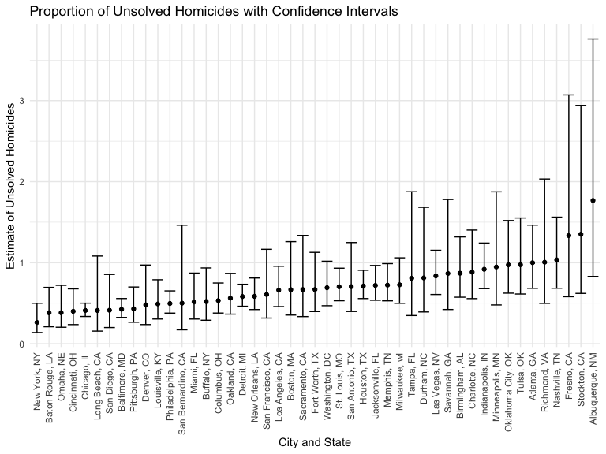
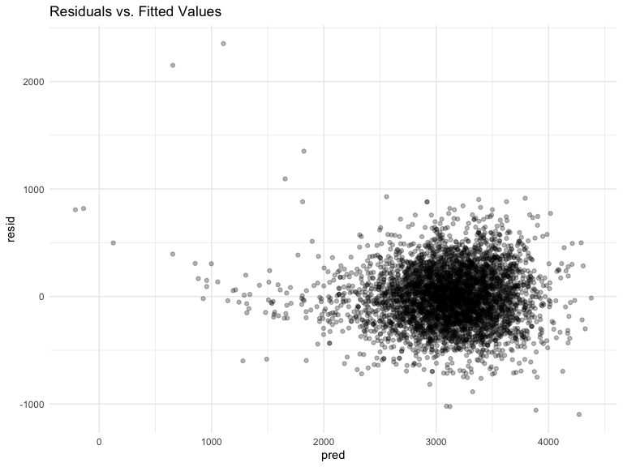

Homework 6
================
Allison Randy-Cofie

### Problem 2

Create a city_state variable (e.g. “Baltimore, MD”), and a binary
variable indicating whether the homicide is solved. Omit cities Dallas,
TX; Phoenix, AZ; and Kansas City, MO – these don’t report victim race.
Also omit Tulsa, AL – this is a data entry mistake. For this problem,
limit your analysis those for whom victim_race is white or black. Be
sure that victim_age is numeric.

``` r
homicide_df <- 
  read_csv("homicide-data.csv", na = c("", "Unknown")) %>% 
  mutate(city_state = str_c(city, ", ", state),
         resolution = case_when(
           disposition == "Closed without arrest" ~ "unsolved",
           disposition == "Open/No arrest" ~ "unsolved",
           disposition == "Closed by arrest" ~ "solved"
         )) %>% 
  filter(city_state != "Dallas, TX",
         city_state != "Phoenix, AZ",
         city_state != "Kansas City, MO",
         city_state != "Tulsa, AL") %>% 
  relocate(uid, reported_date, city_state) %>% 
  mutate(
    victim_age = as.numeric(victim_age)) %>% 
 filter(victim_race %in% c("Black" , "White"))
```

    ## Rows: 52179 Columns: 12
    ## ── Column specification ────────────────────────────────────────────────────────
    ## Delimiter: ","
    ## chr (8): uid, victim_last, victim_first, victim_race, victim_sex, city, stat...
    ## dbl (4): reported_date, victim_age, lat, lon
    ## 
    ## ℹ Use `spec()` to retrieve the full column specification for this data.
    ## ℹ Specify the column types or set `show_col_types = FALSE` to quiet this message.

For the city of Baltimore, MD, use the glm function to fit a logistic
regression with resolved vs unresolved as the outcome and victim age,
sex and race as predictors. Save the output of glm as an R object; apply
the broom::tidy to this object; and obtain the estimate and confidence
interval of the adjusted odds ratio for solving homicides comparing male
victims to female victims keeping all other variables fixed.

``` r
baltimore_summary <- 
 homicide_df %>% 
  filter(city_state == "Baltimore, MD") %>% 
mutate(
    resolution = as.numeric(disposition == "Closed by arrest"))

fit = baltimore_summary %>% 
  glm(resolution ~ victim_age + victim_race + victim_sex, data = ., family = binomial()) %>% 
  broom::tidy() %>% 
  mutate(OR = exp(estimate),
         conf.low = exp(estimate-1.96*std.error),
         conf.high = exp(estimate+1.96*std.error)) %>%
  filter(term == "victim_sexMale") %>% 
  select(term, log_OR = estimate, OR, p.value, conf.low, conf.high) %>% 
  knitr::kable(digits = 3)
```

Now run glm for each of the cities in your dataset, and extract the
adjusted odds ratio (and CI) for solving homicides comparing male
victims to female victims. Do this within a “tidy” pipeline, making use
of purrr::map, list columns, and unnest as necessary to create a
dataframe with estimated ORs and CIs for each city.

``` r
homicide_df %>% mutate(
    resolution = as.numeric(resolution == "unsolved"))
```

    ## # A tibble: 39,693 × 14
    ##    uid       repor…¹ city_…² victi…³ victi…⁴ victi…⁵ victi…⁶ victi…⁷ city  state
    ##    <chr>       <dbl> <chr>   <chr>   <chr>   <chr>     <dbl> <chr>   <chr> <chr>
    ##  1 Alb-0000…  2.01e7 Albuqu… SATTER… VIVIANA White        15 Female  Albu… NM   
    ##  2 Alb-0000…  2.01e7 Albuqu… MULA    VIVIAN  White        72 Female  Albu… NM   
    ##  3 Alb-0000…  2.01e7 Albuqu… BOOK    GERALD… White        91 Female  Albu… NM   
    ##  4 Alb-0000…  2.01e7 Albuqu… MARTIN… GUSTAVO White        56 Male    Albu… NM   
    ##  5 Alb-0000…  2.01e7 Albuqu… LUJAN   KEVIN   White        NA Male    Albu… NM   
    ##  6 Alb-0000…  2.01e7 Albuqu… GRAY    STEFAN… White        43 Female  Albu… NM   
    ##  7 Alb-0000…  2.01e7 Albuqu… DAVID   LARRY   White        52 Male    Albu… NM   
    ##  8 Alb-0000…  2.01e7 Albuqu… BRITO   ELIZAB… White        22 Female  Albu… NM   
    ##  9 Alb-0000…  2.01e7 Albuqu… KING    TEVION  Black        15 Male    Albu… NM   
    ## 10 Alb-0000…  2.01e7 Albuqu… BOYKIN  CEDRIC  Black        25 Male    Albu… NM   
    ## # … with 39,683 more rows, 4 more variables: lat <dbl>, lon <dbl>,
    ## #   disposition <chr>, resolution <dbl>, and abbreviated variable names
    ## #   ¹​reported_date, ²​city_state, ³​victim_last, ⁴​victim_first, ⁵​victim_race,
    ## #   ⁶​victim_age, ⁷​victim_sex

``` r
homicide_results = 
homicide_df %>% 
  mutate(resolution = as.numeric(disposition == "Closed by arrest"))%>% 
  nest(data = -city_state) %>% 
  mutate(
    models = purrr::map(.x = data, ~glm(resolution ~ victim_age + victim_race + victim_sex, data = .x, family = binomial())),
    results = purrr::map(models, broom::tidy))%>% 
  unnest(results) %>%
  filter(term == "victim_sexMale") %>% 
  select(city_state,estimate, std.error)%>% 
  mutate(OR = exp(estimate),
         conf.low = exp(estimate-1.96*std.error),
         conf.high = exp(estimate+1.96*std.error)) 

homicide_results%>% 
  knitr::kable(digits = 3)
```

| city_state         | estimate | std.error |    OR | conf.low | conf.high |
|:-------------------|---------:|----------:|------:|---------:|----------:|
| Albuquerque, NM    |    0.570 |     0.385 | 1.767 |    0.831 |     3.761 |
| Atlanta, GA        |    0.000 |     0.194 | 1.000 |    0.684 |     1.463 |
| Baltimore, MD      |   -0.854 |     0.138 | 0.426 |    0.325 |     0.558 |
| Baton Rouge, LA    |   -0.964 |     0.306 | 0.381 |    0.209 |     0.695 |
| Birmingham, AL     |   -0.139 |     0.212 | 0.870 |    0.574 |     1.318 |
| Boston, MA         |   -0.404 |     0.324 | 0.667 |    0.354 |     1.260 |
| Buffalo, NY        |   -0.653 |     0.299 | 0.521 |    0.290 |     0.935 |
| Charlotte, NC      |   -0.123 |     0.236 | 0.884 |    0.557 |     1.403 |
| Chicago, IL        |   -0.891 |     0.102 | 0.410 |    0.336 |     0.501 |
| Cincinnati, OH     |   -0.917 |     0.269 | 0.400 |    0.236 |     0.677 |
| Columbus, OH       |   -0.630 |     0.174 | 0.532 |    0.378 |     0.750 |
| Denver, CO         |   -0.736 |     0.360 | 0.479 |    0.236 |     0.971 |
| Detroit, MI        |   -0.541 |     0.118 | 0.582 |    0.462 |     0.734 |
| Durham, NC         |   -0.208 |     0.372 | 0.812 |    0.392 |     1.683 |
| Fort Worth, TX     |   -0.402 |     0.266 | 0.669 |    0.397 |     1.127 |
| Fresno, CA         |    0.289 |     0.425 | 1.335 |    0.580 |     3.071 |
| Houston, TX        |   -0.341 |     0.124 | 0.711 |    0.558 |     0.907 |
| Indianapolis, IN   |   -0.085 |     0.154 | 0.919 |    0.679 |     1.242 |
| Jacksonville, FL   |   -0.329 |     0.150 | 0.720 |    0.537 |     0.966 |
| Las Vegas, NV      |   -0.178 |     0.164 | 0.837 |    0.608 |     1.154 |
| Long Beach, CA     |   -0.891 |     0.495 | 0.410 |    0.156 |     1.082 |
| Los Angeles, CA    |   -0.413 |     0.188 | 0.662 |    0.458 |     0.956 |
| Louisville, KY     |   -0.712 |     0.243 | 0.491 |    0.305 |     0.790 |
| Memphis, TN        |   -0.324 |     0.159 | 0.723 |    0.529 |     0.988 |
| Miami, FL          |   -0.663 |     0.268 | 0.515 |    0.304 |     0.872 |
| Milwaukee, wI      |   -0.319 |     0.192 | 0.727 |    0.499 |     1.060 |
| Minneapolis, MN    |   -0.054 |     0.348 | 0.947 |    0.478 |     1.875 |
| Nashville, TN      |    0.034 |     0.210 | 1.034 |    0.685 |     1.562 |
| New Orleans, LA    |   -0.536 |     0.167 | 0.585 |    0.422 |     0.811 |
| New York, NY       |   -1.338 |     0.328 | 0.262 |    0.138 |     0.499 |
| Oakland, CA        |   -0.574 |     0.221 | 0.563 |    0.365 |     0.868 |
| Oklahoma City, OK  |   -0.026 |     0.227 | 0.974 |    0.624 |     1.520 |
| Omaha, NE          |   -0.961 |     0.323 | 0.382 |    0.203 |     0.721 |
| Philadelphia, PA   |   -0.701 |     0.139 | 0.496 |    0.378 |     0.652 |
| Pittsburgh, PA     |   -0.842 |     0.248 | 0.431 |    0.265 |     0.700 |
| Richmond, VA       |    0.006 |     0.359 | 1.006 |    0.498 |     2.033 |
| San Antonio, TX    |   -0.350 |     0.292 | 0.705 |    0.398 |     1.249 |
| Sacramento, CA     |   -0.402 |     0.353 | 0.669 |    0.335 |     1.337 |
| Savannah, GA       |   -0.143 |     0.367 | 0.867 |    0.422 |     1.780 |
| San Bernardino, CA |   -0.692 |     0.547 | 0.500 |    0.171 |     1.462 |
| San Diego, CA      |   -0.884 |     0.371 | 0.413 |    0.200 |     0.855 |
| San Francisco, CA  |   -0.498 |     0.332 | 0.608 |    0.317 |     1.165 |
| St. Louis, MO      |   -0.352 |     0.144 | 0.703 |    0.530 |     0.932 |
| Stockton, CA       |    0.301 |     0.397 | 1.352 |    0.621 |     2.942 |
| Tampa, FL          |   -0.214 |     0.430 | 0.808 |    0.348 |     1.876 |
| Tulsa, OK          |   -0.025 |     0.237 | 0.976 |    0.614 |     1.552 |
| Washington, DC     |   -0.370 |     0.198 | 0.691 |    0.469 |     1.018 |

Create a plot that shows the estimated ORs and CIs for each city.
Organize cities according to estimated OR, and comment on the plot.

``` r
homicide_results %>%
  mutate(city_state = fct_reorder(city_state, OR)) %>%
  ggplot(aes(x = city_state, y = OR)) +
  geom_point() +
  geom_errorbar(aes(ymin = conf.low, ymax = conf.high)) + 
  theme(axis.text.x = element_text(angle = 90, vjust = .5, hjust = 1)) +
  labs(title = "Proportion of Unsolved Homicides with Confidence Intervals", 
       x = "City and State",
       y = "Estimate of Unsolved Homicides")
```



### Problem 3

Load and clean the data for regression analysis (i.e. convert numeric to
factor where appropriate, check for missing data, etc.).

Loading the Dataset

``` r
birthweight = read_csv("./birthweight.csv") %>%
  janitor::clean_names() %>%
  mutate(
    babysex = factor(babysex),
    frace = factor(frace),
    malform = factor(malform),
    mrace = factor(mrace)
  )
```

    ## Rows: 4342 Columns: 20
    ## ── Column specification ────────────────────────────────────────────────────────
    ## Delimiter: ","
    ## dbl (20): babysex, bhead, blength, bwt, delwt, fincome, frace, gaweeks, malf...
    ## 
    ## ℹ Use `spec()` to retrieve the full column specification for this data.
    ## ℹ Specify the column types or set `show_col_types = FALSE` to quiet this message.

The are no missing values in this dataset.

Propose a regression model for birthweight. This model may be based on a
hypothesized structure for the factors that underly birthweight, on a
data-driven model-building process, or a combination of the two.
Describe your modeling process and show a plot of model residuals
against fitted values – use add_predictions and add_residuals in making
this plot.

I’ll propose a model for this problem using backward stepwise selection.

``` r
model_init <- lm(bwt ~., data = birthweight)
step(model_init, direction = "backward") #type of selection
```

    ## Start:  AIC=48717.83
    ## bwt ~ babysex + bhead + blength + delwt + fincome + frace + gaweeks + 
    ##     malform + menarche + mheight + momage + mrace + parity + 
    ##     pnumlbw + pnumsga + ppbmi + ppwt + smoken + wtgain
    ## 
    ## 
    ## Step:  AIC=48717.83
    ## bwt ~ babysex + bhead + blength + delwt + fincome + frace + gaweeks + 
    ##     malform + menarche + mheight + momage + mrace + parity + 
    ##     pnumlbw + pnumsga + ppbmi + ppwt + smoken
    ## 
    ## 
    ## Step:  AIC=48717.83
    ## bwt ~ babysex + bhead + blength + delwt + fincome + frace + gaweeks + 
    ##     malform + menarche + mheight + momage + mrace + parity + 
    ##     pnumlbw + ppbmi + ppwt + smoken
    ## 
    ## 
    ## Step:  AIC=48717.83
    ## bwt ~ babysex + bhead + blength + delwt + fincome + frace + gaweeks + 
    ##     malform + menarche + mheight + momage + mrace + parity + 
    ##     ppbmi + ppwt + smoken
    ## 
    ##            Df Sum of Sq       RSS   AIC
    ## - frace     4    124365 320848704 48712
    ## - malform   1      1419 320725757 48716
    ## - ppbmi     1      6346 320730684 48716
    ## - momage    1     28661 320752999 48716
    ## - mheight   1     66886 320791224 48717
    ## - menarche  1    111679 320836018 48717
    ## - ppwt      1    131132 320855470 48718
    ## <none>                  320724338 48718
    ## - fincome   1    193454 320917792 48718
    ## - parity    1    413584 321137922 48721
    ## - mrace     3    868321 321592659 48724
    ## - babysex   1    853796 321578134 48727
    ## - gaweeks   1   4611823 325336161 48778
    ## - smoken    1   5076393 325800732 48784
    ## - delwt     1   8008891 328733230 48823
    ## - blength   1 102050296 422774634 49915
    ## - bhead     1 106535716 427260054 49961
    ## 
    ## Step:  AIC=48711.51
    ## bwt ~ babysex + bhead + blength + delwt + fincome + gaweeks + 
    ##     malform + menarche + mheight + momage + mrace + parity + 
    ##     ppbmi + ppwt + smoken
    ## 
    ##            Df Sum of Sq       RSS   AIC
    ## - malform   1      1447 320850151 48710
    ## - ppbmi     1      6975 320855679 48710
    ## - momage    1     28379 320877083 48710
    ## - mheight   1     69502 320918206 48710
    ## - menarche  1    115708 320964411 48711
    ## - ppwt      1    133961 320982665 48711
    ## <none>                  320848704 48712
    ## - fincome   1    194405 321043108 48712
    ## - parity    1    414687 321263390 48715
    ## - babysex   1    852133 321700837 48721
    ## - gaweeks   1   4625208 325473911 48772
    ## - smoken    1   5036389 325885093 48777
    ## - delwt     1   8013099 328861802 48817
    ## - mrace     3  13540415 334389119 48885
    ## - blength   1 101995688 422844392 49908
    ## - bhead     1 106662962 427511666 49956
    ## 
    ## Step:  AIC=48709.53
    ## bwt ~ babysex + bhead + blength + delwt + fincome + gaweeks + 
    ##     menarche + mheight + momage + mrace + parity + ppbmi + ppwt + 
    ##     smoken
    ## 
    ##            Df Sum of Sq       RSS   AIC
    ## - ppbmi     1      6928 320857079 48708
    ## - momage    1     28660 320878811 48708
    ## - mheight   1     69320 320919470 48708
    ## - menarche  1    116027 320966177 48709
    ## - ppwt      1    133894 320984044 48709
    ## <none>                  320850151 48710
    ## - fincome   1    193784 321043934 48710
    ## - parity    1    414482 321264633 48713
    ## - babysex   1    851279 321701430 48719
    ## - gaweeks   1   4624003 325474154 48770
    ## - smoken    1   5035195 325885346 48775
    ## - delwt     1   8029079 328879230 48815
    ## - mrace     3  13553320 334403471 48883
    ## - blength   1 102009225 422859375 49906
    ## - bhead     1 106675331 427525481 49954
    ## 
    ## Step:  AIC=48707.63
    ## bwt ~ babysex + bhead + blength + delwt + fincome + gaweeks + 
    ##     menarche + mheight + momage + mrace + parity + ppwt + smoken
    ## 
    ##            Df Sum of Sq       RSS   AIC
    ## - momage    1     29211 320886290 48706
    ## - menarche  1    117635 320974714 48707
    ## <none>                  320857079 48708
    ## - fincome   1    195199 321052278 48708
    ## - parity    1    412984 321270064 48711
    ## - babysex   1    850020 321707099 48717
    ## - mheight   1   1078673 321935752 48720
    ## - ppwt      1   2934023 323791103 48745
    ## - gaweeks   1   4621504 325478583 48768
    ## - smoken    1   5039368 325896447 48773
    ## - delwt     1   8024939 328882018 48813
    ## - mrace     3  13551444 334408523 48881
    ## - blength   1 102018559 422875638 49904
    ## - bhead     1 106821342 427678421 49953
    ## 
    ## Step:  AIC=48706.02
    ## bwt ~ babysex + bhead + blength + delwt + fincome + gaweeks + 
    ##     menarche + mheight + mrace + parity + ppwt + smoken
    ## 
    ##            Df Sum of Sq       RSS   AIC
    ## - menarche  1    100121 320986412 48705
    ## <none>                  320886290 48706
    ## - fincome   1    240800 321127090 48707
    ## - parity    1    431433 321317724 48710
    ## - babysex   1    841278 321727568 48715
    ## - mheight   1   1076739 321963029 48719
    ## - ppwt      1   2913653 323799943 48743
    ## - gaweeks   1   4676469 325562760 48767
    ## - smoken    1   5045104 325931394 48772
    ## - delwt     1   8000672 328886962 48811
    ## - mrace     3  14667730 335554021 48894
    ## - blength   1 101990556 422876847 49902
    ## - bhead     1 106864308 427750598 49952
    ## 
    ## Step:  AIC=48705.38
    ## bwt ~ babysex + bhead + blength + delwt + fincome + gaweeks + 
    ##     mheight + mrace + parity + ppwt + smoken
    ## 
    ##           Df Sum of Sq       RSS   AIC
    ## <none>                 320986412 48705
    ## - fincome  1    245637 321232048 48707
    ## - parity   1    422770 321409181 48709
    ## - babysex  1    846134 321832545 48715
    ## - mheight  1   1012240 321998651 48717
    ## - ppwt     1   2907049 323893461 48743
    ## - gaweeks  1   4662501 325648912 48766
    ## - smoken   1   5073849 326060260 48771
    ## - delwt    1   8137459 329123871 48812
    ## - mrace    3  14683609 335670021 48894
    ## - blength  1 102191779 423178191 49903
    ## - bhead    1 106779754 427766166 49950

    ## 
    ## Call:
    ## lm(formula = bwt ~ babysex + bhead + blength + delwt + fincome + 
    ##     gaweeks + mheight + mrace + parity + ppwt + smoken, data = birthweight)
    ## 
    ## Coefficients:
    ## (Intercept)     babysex2        bhead      blength        delwt      fincome  
    ##   -6098.822       28.558      130.777       74.947        4.107        0.318  
    ##     gaweeks      mheight       mrace2       mrace3       mrace4       parity  
    ##      11.592        6.594     -138.792      -74.887     -100.678       96.305  
    ##        ppwt       smoken  
    ##      -2.676       -4.843

This model selection approach starts with all predictors in the model
then removes the the least significant predictor. The process is
repeated until all non-significant predictors have been removed.

The final model includes the following predictors:

-   baby sex
-   baby head circumference
-   baby length
-   mother’s weight at delivery
-   family monthly income
-   gestational age
-   mother’s height
-   mother’s race
-   number of lives births prior to this pregnancy
-   mother’s pre-pregnancy weight
-   average number of cigarettes smoked per day during pregnancy

``` r
#final model
model_back = lm(bwt ~ babysex + bhead + blength + delwt + fincome + 
    gaweeks + mheight + mrace + parity + ppwt + smoken, data = birthweight)
```

#### Plot of Model Residuals vs. Fitted Values.

``` r
birthweight %>%
  add_residuals(model_back) %>%
  add_predictions(model_back) %>%
  ggplot(aes(x = pred, y = resid)) + geom_point(alpha = .3) +
  labs(title = "Residuals vs. Fitted Values")
```



#### Model Comparison

I’ll compare my model to two others:

-   A model using length at birth and gestational age as predictors
    (Main Effects)
-   One using head circumference, length, sex, and all interactions
    between these (Interaction Model)

``` r
cv_df = crossv_mc(birthweight, 100) %>%
  mutate(
    train = map(train, as_tibble),
    test = map(test, as_tibble),
    backwards_mod = map(train, ~lm(bwt ~ babysex + bhead + blength + delwt + fincome + 
    gaweeks + mheight + mrace + parity + ppwt + smoken, data = .x)),
    mod_main_effect = map(train, ~lm(bwt ~ blength + gaweeks, data = .x)),
    mod_interaction = map(train, ~lm(bwt ~ bhead + blength + babysex 
                                     + bhead * blength 
                                     + bhead * babysex 
                                     + blength * babysex 
                                     + bhead * blength * babysex, data = .x)), 
    rmse_backwards_mod = map2_dbl(backwards_mod, test, ~rmse(model = .x, data = .y)),
    rmse_mod_main_effect = map2_dbl(mod_main_effect, test, ~rmse(model = .x, data = .y)),
    rmse_mod_interaction = map2_dbl(mod_interaction, test, ~rmse(model = .x, data = .y)))
```

Let’s look at the results

``` r
cv_df %>%
  select(starts_with("rmse")) %>%
  pivot_longer(
    everything(),
    names_to = "model",
    values_to = "rmse",
    names_prefix = "rmse_") %>%
  ggplot(aes(x = model, y = rmse)) + geom_violin() +
  labs(title = "RMSE for Cross-Validated Models", x = "Model Type", y = "RMSE")
```


The plot shows that the model made using the backward stepwise selection
has the lowest RMSE, and therefore is the best performing of the three,
in terms of predicting baby weight. The interaction model has a slightly
greater RMSE than the proposed model, however the inclusion of
interaction terms would make it harder to interpret than the other
models. The main effect model had the largest RMSE.
